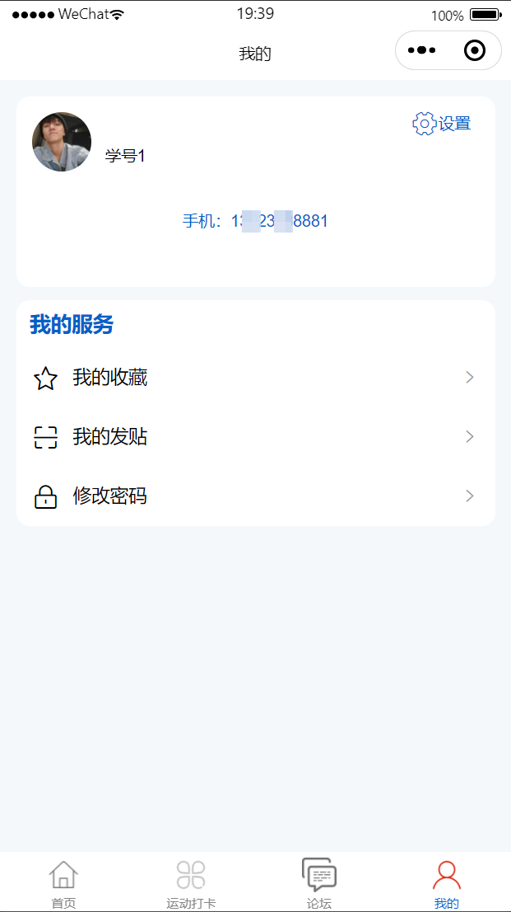

# mpweixinA090
mpweixinA090学生运动打卡微信小程序
 
## 查看主页获取源码

### 一、关键词
学生运动签到小程序，学生体育打卡小程序，学生运动记录打卡小程序

### 二、作品包含
源码+数据库+全套环境和工具资源+本地部署教程

### 三、项目技术
前端技术： Html、Css、Js、Vue2.0、Element-ui、uniapp
后端技术：Java、SpringBoot2.0、MyBatis

### 四、运行环境（以下版本亲测，其他版本兼容性请自行测试）
开发工具：IDEA/eclipse  + VSCODE + 微信开发者工具 + HBuilder X

数据库：MySQL5.7（最低要5.7版本）

数据库管理工具：Navicat10以上版本

环境配置软件： JDK1.8 + Maven3.6.3

前端Nodejs：14

浏览器：谷歌浏览器

### 五、项目介绍
项目编号：mpweixinA090

学生运动打卡微信小程序可帮助学生便捷记录日常运动数据、参与运动任务，同时方便学校或老师监督学生运动情况、统计运动成果，助力培养学生规律运动习惯。
学生运动打卡小程序，支持运动打卡记录，可查看公告信息，还有论坛供交流，同时能管理个人相关服务，助力学生运动管理与校园互动。

### 六、运行截图

